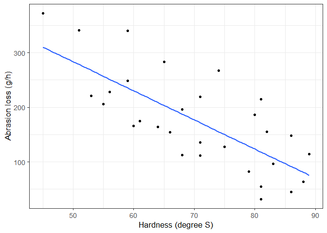

<!-- README.md is generated from README.qmd. Please edit that file -->

# HSDS 

The goal of [HSDS](https://github.com/ABohynDOE/HSDS) is to make all the
data sets of the book [“A Handbook of Small Data
Sets”](https://www.routledge.com/A-Handbook-of-Small-Data-Sets/Hand-Daly-McConway-Lunn-Ostrowski/p/book/9780367449667)
(1994) of David J. Hand available. These data sets are particularly
useful to demonstrate examples of function or statistical tests, but
also to teach about statistics and R.

All data sets are already available individually at this repo:
<https://github.com/JedStephens/Handbook-of-Small-Data-Sets/tree/master>.
However, they are not immediately usable in R, and undocumented. This
package aims to solve this issue, and provide clean and documented data
sets.

Do you like this package and want to support me ? [](https://www.buymeacoffee.com/abohyn)

## Installation

You can install the development version of HSDS like so:

``` r
devtools::install_github("ABohynDOE/HSDS")
```

## Available data sets

The book contains more than 500 data sets. For the moment, only some are
available. They are summarized in the table below, along with their
names, what they contain, their structure, and the type of variables
present.

<div>

<div id="lbpqxqkaag" style="padding-left:0px;padding-right:0px;padding-top:10px;padding-bottom:10px;overflow-x:auto;overflow-y:auto;width:auto;height:auto;">
  &#10;  

| Name                                                                  | Title                                                | Structure | Variables                         |
|:----------------------------------------------------------------------|:-----------------------------------------------------|:----------|:----------------------------------|
| [`germin`](http://abohyndoe.github.io/HSDS/reference/germin.html)     | Germinating seeds                                    | 48 × 3    | factor(2), numeric(1)             |
| [`lengths`](http://abohyndoe.github.io/HSDS/reference/lengths.html)   | Guessing lengths                                     | 113 × 3   | character(1), numeric(2)          |
| [`darwin`](http://abohyndoe.github.io/HSDS/reference/darwin.html)     | Darwin’s cross-fertilized and self-fertilized plants | 30 × 3    | factor(1), integer(1), numeric(1) |
| [`interval`](http://abohyndoe.github.io/HSDS/reference/interval.html) | Intervals between cars on the M1 motorway            | 41 × 2    | character(2)                      |
| [`tearing`](http://abohyndoe.github.io/HSDS/reference/tearing.html)   | Tearing factor for paper                             | 20 × 2    | numeric(2)                        |
| [`abrasion`](http://abohyndoe.github.io/HSDS/reference/abrasion.html) | Abrasion loss                                        | 30 × 3    | numeric(3)                        |
| [`water`](http://abohyndoe.github.io/HSDS/reference/water.html)       | Mortality and water hardness                         | 61 × 5    | factor(1), numeric(4)             |
| [`cement`](http://abohyndoe.github.io/HSDS/reference/cement.html)     | Tensile strength of cement                           | 21 × 2    | numeric(2)                        |
| [`weight`](http://abohyndoe.github.io/HSDS/reference/weight.html)     | Weight gain in rats                                  | 40 × 3    | factor(2), numeric(1)             |
| [`chickens`](http://abohyndoe.github.io/HSDS/reference/chickens.html) | Weight of chickens                                   | 24 × 3    | factor(2), numeric(1)             |
| [`flicker`](http://abohyndoe.github.io/HSDS/reference/flicker.html)   | Flicker frequency                                    | 27 × 4    | factor(3), numeric(1)             |
| [`chloride`](http://abohyndoe.github.io/HSDS/reference/chloride.html) | Effect of ammonium chloride on yield                 | 32 × 5    | factor(4), numeric(1)             |
| [`dishwash`](http://abohyndoe.github.io/HSDS/reference/dishwash.html) | Comparing dishwashing detergents                     | 36 × 3    | factor(2), numeric(1)             |

</div>

</div>

## Example

The `HSDS` package contains many data sets that can be used to create a
variety of different outputs.

``` r
library(hsds)
library(ggplot2)

ggplot(tearing, aes(x = hardness, y = abrasion_loss)) +
  geom_points() +
  geom_smooth(method = "lm")
  theme_bw()
```



## Contributing

We are far from the 500 data sets, so any help is welcome ! If you want
to contribute, all raw data sets are already present in the repo (at
`data-raw/data-files`), so feel free to clean one or more… ! If you do
so, please respect the following guidelines:

- data sets should be named after the data structure index of the book
  (available
  [here](https://github.com/JedStephens/Handbook-of-Small-Data-Sets/blob/master/data_structure_index_HSDS.pdf))

- all variables in the data set should be labelled (using the
  [`labelled`](https://cran.r-project.org/web/packages/labelled/vignettes/intro_labelled.html)
  package for example)

- data sets should be documented using the text from the book
